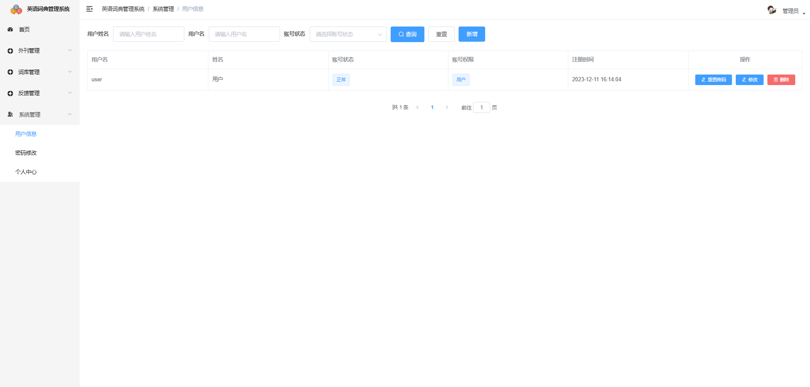

# 基于Java+Springboot+Vue英语词典翻译微信小程序-毕业设计

# 获取地址

#### 作者QQ：3275035005 微信：xkbishe123 (支持修改、 部署调试、 代做接毕业设计和课程设计)

#### 网站建设、小程序、H5、APP、各种系统、样式修改、10000套源码可选。

#### 选题+开题报告+任务书+程序定制+安装调试+论文+答辩ppt 都可以做

#### 问题包修改，包满意，有需求尽管甩过来！一条龙帮你安心过！

#### 所有项目以及源代码本人均调试运行无问题 可支持远程调试运行

# 项目介绍
基于Java+Springboot+Vue英语词典翻译微信小程序-毕业设计，本系统分微信小程序和管理后台两部分，项目采用前后端分离

### 1. 用户

- 用户登录注册
- 单词搜索
- 单词播放
- 单词加入生词本
- 单词删除生词本
- 查看单词生词本
- 查看外刊分类
- 查看外刊新闻
- 外刊新闻订阅
- 外刊新闻取消订阅
- 查看单词词库
- 查看学习计划
- 创建学习计划
- 近期学习情况统计
- 单词复习：不认识单词录入单词复习
- 查看我的订阅外刊
- 查看我意见反馈
- 提交意见反馈
- 个人资料修改
- 退出登录

###  2. 管理员

- 管理员登录
- 外刊信息：分页查询、新增、修改、删除
- 外刊分类信息：分页查询、新增、修改、删除
- 词库信息：分页查询、新增、修改、删除、查看词库单词
- 词库单词信息：导入单词、分页查询、新增、修改、删除
- 反馈记录信息：分页查询、回复、删除
- 用户信息管理：重置密码、分页查询、新增、修改、删除、
- 个人中心：修改
- 密码修改
- 退出登录

# 技术框架
- 开发语言：Java 
- 数据库：Mysql 
- 系统环境：jdk8、maven、node
- 后端框架：SpringBoot、MyBatisplus、MyBatis
- 前端框架：Vue、Elementui、微信小程序
- 工具：IDEA、Navicat、微信开发者工具
- 技术架构：前后端分离、B/S架构、MVC架构
# 项目截图

### 1. 微信端

### 2. 管理端

